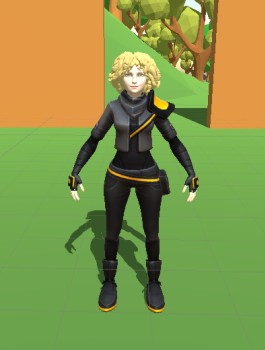
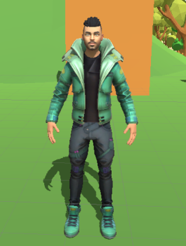
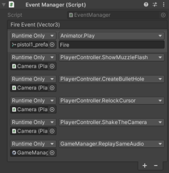
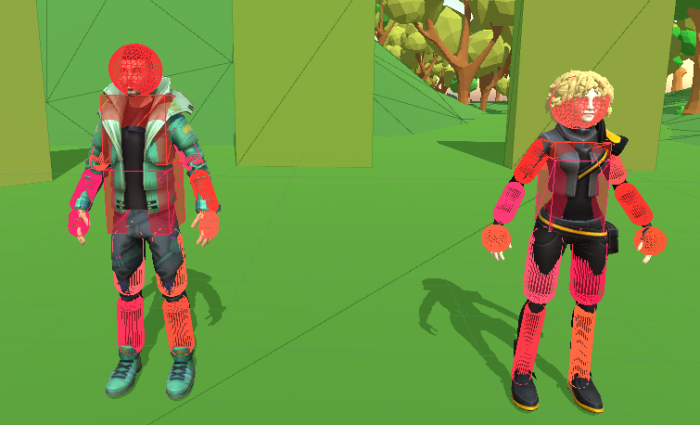
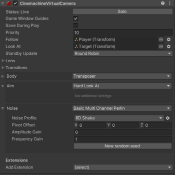

# Fps Reflex Game 
## Platform and Engine

 - **Platform :** PC and WebGL
 - **Engine :** Unity 2020.3.12f1 
 - **Prototype:** [https://yagizayer.github.io/Fps_Reflex_Game_v03/](https://yagizayer.github.io/Fps_Reflex_Game_v03/)
 
## Gameplay 
This project made to improve reflexes.

 - Gameplay 

 - Actors
	 - Victim 

	 - Suspect 

	 
## Technology Details
Used technologies in this project are :
 - Event Driven Programming 

 - Ragdoll Mechanics 

 - Cinemachine 

